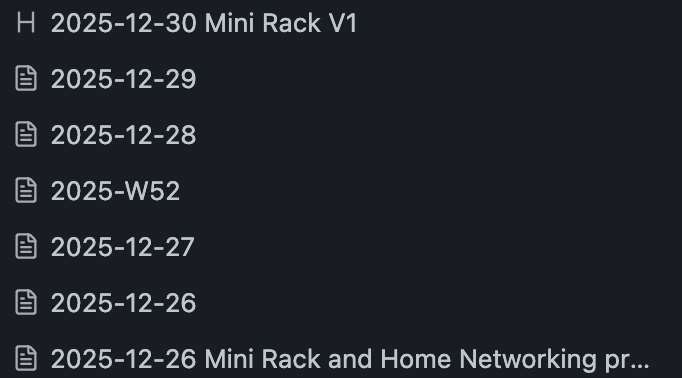

# obsidian-date-browser

A plugin pretty much just for me. Allows browsing Obsidian notes **and
headings** that are dated beginning with YYYY-MM-DD in the sidebar. 

# Why?

I'm a logger; I've given up on systems that require more careful gardening of
notes (such as tags) and just keep logs on larger topics. This makes it easier
to navigate through recent entries to such.

